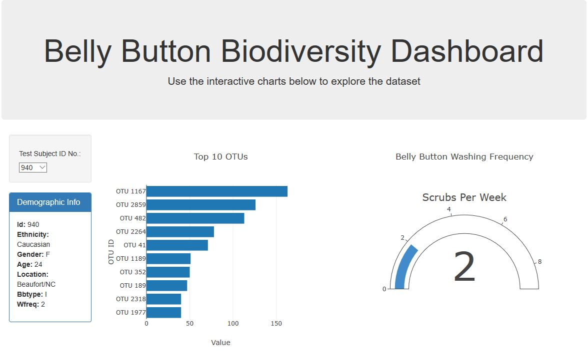
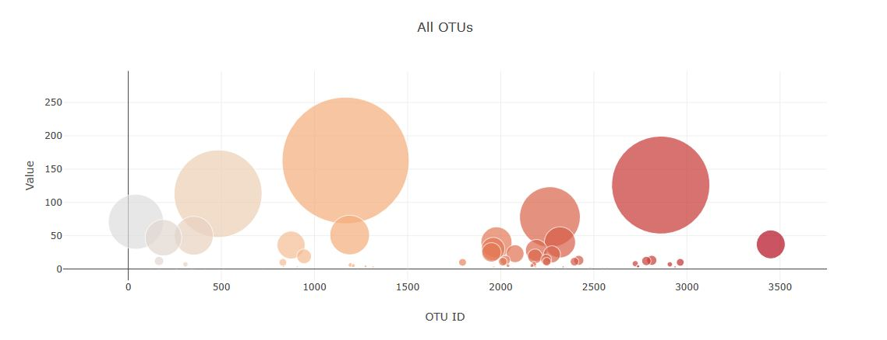

# Belly Button Diversity

## **Objective:**
The objective of this project is to use Plotly and JavaScript to build an interactive dashboard to present data stored in a JSON file. The dataset contains information on microbes, also called operational taxonomic units or OTUs, found inside individuals' belly buttons. 

The information for one individual is displayed on the dashboard and is updated each time a new test subject ID number is selected in the dropdown menu. The following information is presented in the dashboard:
* Text box: Demographic information.
* Horizontal bar graph: Top 10 OTUs.
* Bubble chart: All OTUs.
* Gauge chart: Belly button washing frequency. 

## **Tools:**
1.	HTML
2.	JavaScript - Plotly

## **Screenshot:**

